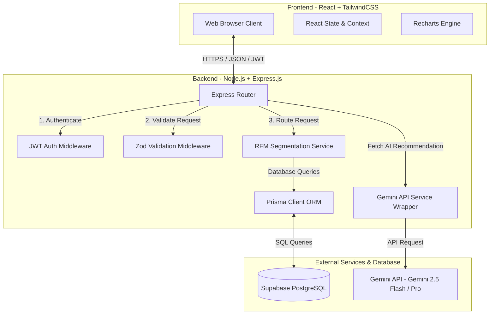
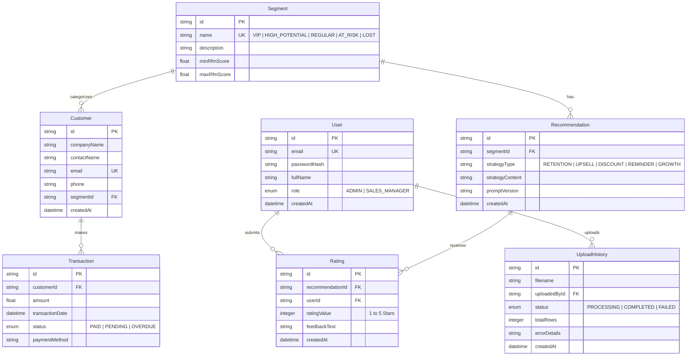

# Phase 1: Project Planning - AI Customer Segment Profitability Analyzer

This document outlines the conceptual design, requirements, database schemas, and system architecture for the **AI Customer Segment Profitability Analyzer** at Manikanta Enterprises.

---

## 1. What We Are Building
We are building a web application that helps businesses (specifically Manikanta Enterprises) understand their customer base using data. 
Admin users can upload a CSV (Comma-Separated Values) file containing raw customer transactions. The system automatically:
1. Cleans and processes the transactions.
2. Calculates **RFM (Recency, Frequency, Monetary)** scores for each customer.
3. Groups customers into five distinct **profitability segments**:
   - **VIP Customers**: High value, frequent purchasers, recently active.
   - **High Potential**: Good spending, relatively active, showing growth potential.
   - **Regular Customers**: Moderate spending, steady frequency.
   - **At Risk**: Have not purchased recently, warning signs of churn.
   - **Lost Customers**: Inactive for a long time, very low value.
4. Uses the **Gemini API** to generate tailored business engagement strategies for each segment (e.g., retention plans, upsell options, payment reminders).
5. Displays all of this on a beautiful analytics dashboard for both Admins and Sales Managers.

## 2. Why We Are Building It
In business, the **Pareto Principle (80/20 Rule)** often applies: 80% of revenue comes from 20% of customers.
- **The Problem**: Sales and customer success teams often spend the same amount of time and effort chasing low-value or high-risk customers as they do servicing high-value VIPs. This is highly inefficient.
- **The Solution**: By segmenting customers by profitability and payment behavior, sales managers can focus their efforts on:
  - Retaining VIPs.
  - Upselling High-Potential clients.
  - Minimizing credit risk from overdue/bad-paying accounts.
  - Automating the generation of highly targeted strategies using AI, reducing manual analysis time from days to seconds.

---

## 3. Folder Structure (Proposed Workspace)
We will organize our repository as a monorepo split into a `frontend` and a `backend`, which is standard industry practice for React/Express codebases.

```text
ai-segment-analyzer/
├── backend/                  # Express.js Server
│   ├── src/
│   │   ├── config/           # Database, Gemini API configurations
│   │   ├── controllers/      # Route request handlers
│   │   ├── middleware/       # Authentication, Validation, Error Handler
│   │   ├── routes/           # API Endpoints
│   │   ├── services/         # Business logic (RFM math, AI prompts)
│   │   └── index.js          # App entrypoint
│   ├── prisma/               # Prisma schema & migrations directory
│   │   ├── schema.prisma     # Database models
│   │   └── seed.js           # Seed data script
│   ├── .env.example          # Environment variables template
│   └── package.json          # Backend dependencies
│
├── frontend/                 # React (Vite) Frontend
│   ├── src/
│   │   ├── components/       # Reusable UI components (Sidebar, Card, Toast)
│   │   ├── pages/            # Page-level components (Dashboard, Upload, History)
│   │   ├── hooks/            # Custom state hooks
│   │   ├── context/          # Auth context state provider
│   │   ├── lib/              # Shared utility modules (axios, chart configurations)
│   │   ├── index.css         # Styling system (Tailwind imports)
│   │   └── main.jsx          # React app entry point
│   ├── tailwind.config.js    # Tailwind layout and themes
│   └── package.json          # Frontend dependencies
│
└── docs/                     # Design specs and database guides
    └── phase1_planning.md    # Copy of this file
```

---

## 4. Files to Create in Phase 1
No executable code is written in Phase 1. Instead, we create our documentation and planning assets inside the `docs/` folder:
- `docs/phase1_planning.md`: A local record of this planning phase.

---

## 5. System Architecture Diagram
The architecture is split into three main tiers: UI (Frontend), Server (Backend), and Data/AI layers.



---

## 6. Database ER Diagram (Entity-Relationship)
Here is how our tables relate to one another. We use Prisma-compatible structures to define relationships.



---

## 7. Functional & Non-Functional Requirements

### Functional Requirements (What the system MUST do)
1. **User Authentication**: Secure login using JSON Web Tokens (JWT) for Admins and Sales Managers.
2. **Role-Based Authorization**:
   - **Admin**: Can upload transactions, configure segmentation parameters, view reports, manage prompts.
   - **Sales Manager**: Can view segments, read and rate AI recommendations, look up individual customer cards.
3. **Data Importing**: Accepts CSV file upload containing `CustomerName`, `Email`, `TransactionAmount`, `TransactionDate`, `PaymentStatus`. Validates schema and handles errors gracefully.
4. **RFM Computation Engine**: Automatically calculates:
   - **Recency**: Days since customer's last purchase.
   - **Frequency**: Total number of purchases.
   - **Monetary**: Total revenue generated by the customer.
5. **AI Generator Integration**: Uses the Gemini API to supply structured advice tailored for each of the 5 segments.
6. **Analytics Portal**: Displays metrics (Lifetime Value, Average Order Value, payment collection rates) using charts.

### Non-Functional Requirements (How the system behaves)
1. **Security**: Password hashing using `bcrypt`. JWT secrets must remain stored as environment variables.
2. **Usability**: Responsive web design optimized for desktop and mobile tablets used by sales reps in the field.
3. **Reliability**: CSV upload processes up to 10,000 records without timing out (using database transaction batches).
4. **Performance**: API responses for analytics dashboards must load in under 1 second using database indexes.

---

## 8. User Stories & Use Cases

### User Stories
- *As an Admin*, I want to upload a customer sales history CSV file so that I don't have to manually update customer spending records.
- *As a Sales Manager*, I want to see which customers are "At Risk" so that I can call them and prevent them from leaving us.
- *As a Sales Agent*, I want an AI-suggested payment reminder script so that I know exactly what to say to customers with overdue balances.

### Key Use Case: Uploading Data and Extracting Recommendations
1. **Actor**: Admin
2. **Preconditions**: Admin is logged in. CSV file is formatted correctly.
3. **Flow of Events**:
   - Admin uploads CSV in the portal.
   - Server parses and sanitizes rows, discarding corrupt fields, saving clean rows to `Transactions` and `Customers` tables.
   - Server runs the RFM algorithm, resetting segment tags.
   - AI generates new business action scripts.
4. **Postconditions**: The dashboard updates immediately showing new segment lists.

---

## 9. Common Planning Mistakes & Debugging Design Errors
As a beginner developer, here are common pitfalls to avoid:
- **Mistake 1: Not Normalizing Data**. Storing transaction totals inside the `Customer` table instead of using a separate `Transaction` table. This causes severe data inconsistency.
- **Mistake 2: Missing Indexing**. Forgetting to index database columns like `customerId` or `transactionDate`. This will make the database slow when data grows.
- **Mistake 3: Hardcoding Secrets**. Putting API keys or database strings directly into the code. We will use a `.env` file from the start.
- **Debugging Architectural Flaws**: Verify your entity relationships! If two tables references each other recursively without a clear entrypoint, database migrations will fail.

---

## 10. Verification Plan

### Manual Verification
- We will review this plan with the user/stakeholders to verify that all constraints (tech stack, role authorizations, API endpoints) align with the Manikanta Enterprises internship expectations.
- We will verify that the Mermaid diagrams compile correctly in the markdown rendering engines.

---

## 11. Git Commits for Phase 1
When initializing the repository, our commit history should reflect this planning step:
- **Commit message**: `docs: add phase 1 project planning and system architecture diagrams`
- **Why**: Keeps our repository's documentation up to date right from the first day.
