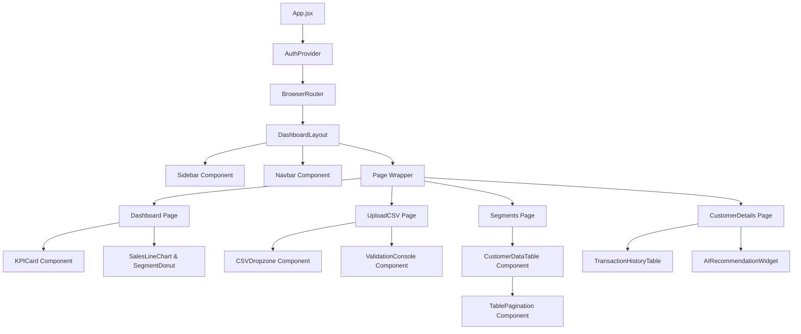

# Phase 2: UI/UX Design Plan - AI Customer Segment Profitability Analyzer

This document defines the interface design, wireframes, style guide (colors & typography), and component hierarchy for the application.

---

## 1. What We Are Building
We are designing the user interface (UI) and user experience (UX) layouts for 9 primary screens:
1. **Login**: Safe entry gate for Admins and Sales Managers.
2. **Dashboard (Home)**: High-level overview of total revenue, active customers, and segment counts.
3. **Upload CSV**: File drop interface with validation logs and status indicators.
4. **Customer Segments**: Visual categorization view (VIP, regular, at-risk lists).
5. **Customer Details**: Deep dive into customer transaction history, RFM metrics, and active AI tags.
6. **AI Recommendations**: Interactive pane displaying Gemini-generated sales recommendations, with buttons to copy/regenerate.
7. **History**: Log of previous data imports and historical AI advice versions.
8. **Analytics Dashboard**: Advanced data visualization using charts (revenue over time, segment distribution).
9. **Settings**: Configuration settings (API Keys, prompt inputs).

## 2. Why We Are Building It
- **User Focus**: A clean layout ensures that sales representatives can navigate customer profiles in seconds while on calls.
- **Visual WOW Factor**: Using a modern dark-theme dashboard with custom HSL gradient lines makes the app look extremely premium, increasing user trust.

---

## 3. Style Guide: Typography & Colors

### Color Palette (Tailwind CSS HSL Config)
We will use modern, low-fatigue dark slate HSL variables that plug directly into Tailwind and Shadcn UI:

| Color Role | Hex Equivalent | HSL Value | Purpose |
| :--- | :--- | :--- | :--- |
| **Background** | `#020817` | `hsl(222.2, 84%, 4.9%)` | Dark app canvas background |
| **Card / Panel** | `#0f172a` | `hsl(217.2, 32.6%, 17.5%)` | Secondary surfaces and containers |
| **Primary (Accent)** | `#6366f1` | `hsl(243, 75.4%, 58.6%)` | Indigo: Buttons, active state outlines |
| **Success (VIP)** | `#10b981` | `hsl(142.1, 70.6%, 45.3%)` | Emerald: High-value metrics and VIP tags |
| **Warning (At Risk)** | `#f59e0b` | `hsl(37.7, 92.1%, 50.2%)` | Amber: Pending transactions and risk tags |
| **Danger (Lost)** | `#ef4444` | `hsl(346.8, 77.2%, 49.8%)` | Rose: Lost accounts and payment issues |
| **Text Foreground** | `#f8fafc` | `hsl(210, 40%, 98%)` | Primary high-contrast text |
| **Text Muted** | `#94a3b8` | `hsl(215, 20.2%, 65.1%)` | Subtext and table headers |

### Typography
- **Headings**: `Outfit` (Google Font). Sleek, geometric font that gives a premium tech aesthetic.
- **Body & Data**: `Inter` (Google Font). Standard for corporate UI due to exceptional legibility at small sizes.

---

## 4. Visual Wireframes (Layout Guides)

Here are the text-based grid wireframe structures to guide component placement:

### 1. Dashboard Layout (Shell)
All pages (except Login) live inside this primary shell:
```text
+--------------------------------------------------------------+
| [Logo] AI segmenter | User Profile (Admin/Sales) [Dropdown]  | Navbar
+---------------------+----------------------------------------+
| (o) Dashboard       |                                        |
| [^] Upload CSV      |                                        |
| [=] Segments        |             [ Main Content ]           |
| [/] Analytics       |                                        |
| [*] History         |             (Varies by Page)           | Page Container
| [!] Settings        |                                        |
|                     |                                        |
| [->] Logout         |                                        |
+---------------------+----------------------------------------+
       Sidebar
```

### 2. Main Dashboard Page Wireframe
```text
+--------------------------------------------------------------+
| Dashboard                                                    |
+--------------------------------------------------------------+
| [ Total Revenue  ] [ Total Customers ] [ Overdue Accounts   ] | KPI Cards
| [  $1,240,500    ] [      2,450      ] [       12           ] |
+--------------------------------------------------------------+
|                               |                              |
|   [ Sales Trend Chart ]       |    [ Segment Distribution ]  |
|   (Line chart showing         |    (Donut chart: VIP,        | Charts Section
|   monetary values over time)  |    Regular, At Risk, etc.)   |
|                               |                              |
+--------------------------------------------------------------+
|  [ Recent AI Strategy Log ]                                  |
|  - VIP Segment strategy updated (10 min ago)                 | Table List
|  - Lost customer alerts sent (2 hours ago)                   |
+--------------------------------------------------------------+
```

### 3. Upload CSV Wireframe
```text
+--------------------------------------------------------------+
| Upload Transaction CSV                                       |
+--------------------------------------------------------------+
|  +-------------------------------------------------------+  |
|  |           Drag & Drop CSV File here or Click          |  | File Dropzone
|  |                (Supports up to 10MB)                  |  |
|  +-------------------------------------------------------+  |
|                                                              |
|  [ Upload Progress Bar: 75% ]                                | Status
|                                                              |
|  [ Validation Log Messages ]                                 | Logs Console
|  * Row 12: Invalid email skipped (Cleaned)                   |
|  * Row 45: Duplicate transaction merged (Cleaned)            |
+--------------------------------------------------------------+
```

### 4. Customer Segments Wireframe
```text
+--------------------------------------------------------------+
| Customer Segmentation Portal                                 |
+--------------------------------------------------------------+
| [Search...] | [All Segments v] | [Payment Status v]         | Filters
+--------------------------------------------------------------+
| Company       | Contact     | Monetary | Segment   | Action  |
|---------------+-------------+----------+-----------+---------|
| Acme Corp     | John Doe    | $45,000  | [ VIP ]   | [View]  | Data Table
| Beta Inc      | Sarah Smith | $12,500  | [ Regular]| [View]  |
| Delta LLC     | Bob Johnson | $1,200   | [At Risk] | [View]  |
+--------------------------------------------------------------+
```

---

## 5. React Component Hierarchy
Our components are split into **Global UI** and **Page Components**:



---

## 6. Common Design Mistakes & Solutions
- **Mistake**: Using generic browser scrollbars and tables, which breaks the modern dark aesthetic.
- **Solution**: Use Tailwind's scrollbar scroll utilities and style custom tables using Shadcn UI table styles.
- **Mistake**: Overcrowded dashboards. Showing hundreds of database rows at once without pagination.
- **Solution**: Set a default page size of 10 rows and implement lightweight page navigation buttons.

---

## 7. Verification Plan

### Visual Verification
- Open the mockup image at [dashboard_mockup.png](file:///C:/Users/manin/OneDrive/Desktop/AI%20analyser/docs/assets/dashboard_mockup.png) to review the styling direction.
- Review design coordinates against the HSL palette in Tailwind configuration styles.

---

## 8. Git Commits for Phase 2
- **Commit message**: `docs: add phase 2 UI/UX design wireframes and component layout maps`
